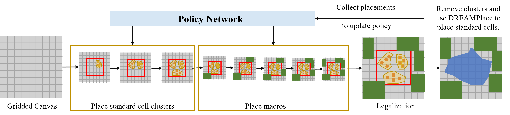

# DeepTH
Modern very-large-scale integrated (VLSI) circuit placement with huge state space is a critical task for achieving layouts with high performance. Recently, reinforcement learning (RL) algorithms have made a promising breakthrough to dramatically save design time than human effort. However, the previous RL-based works either require a large dataset of chip placements for pre-training or produce illegal final placement solutions. In this paper, DeepTH, a three-head policy gradient placer, is proposed to learn from scratch without the need of pre-training, and generate superior chip floorplans. Graph neural network is initially adopted to extract the features from nodes and nets of chips for estimating the policy and value. To efficiently improve the quality of floorplans,  a reconstruction head is employed in the RL network to recover the visual representation of the current placement, by enriching the extracted features of placement embedding. Besides, the reconstruction error is used as a bonus during training to encourage exploration while alleviating the sparse reward problem. Furthermore, the expert knowledge of floorplanning preference is embedded into the decision process to narrow down the potential action space. Experiment results on the ISPD $2005$ benchmark have shown that our method achieves $19.02%$ HPWL improvement than the analytic placer DREAMPlace and $19.89%$ improvement at least than the state-of-the-art RL algorithms.
## Overview
In this paper, DeepTH is proposed to perform macro placement and standard cells are placed by an analytical algorithm. A hypergraph partitioning algorithm is used to first divide standard cells into disjoint clusters based on their netlist connections. Standard cell clusters and macros will be placed on the gridded canvas according to the policy in the order of area from largest to smallest sequentially. When the macros' location is determined, standard cells will be repositioned by DREAMPlace $3.0$, which also gives the evaluation of the final placement. Detailed framework is shown in following figure.

 
## Three Head Neural Network
In general, neural networks in RL only have two heads to estimate the policy and value. A three-head network is proposed by employing a reconstruction head to recover the placement's visual representation. Object features and the adjacent matrix is provided as the network's input and each object is described by its width, height, whether is placed or not and the placed coordinates. Obviously, the input object features have enough information to reconstruct the current placement visually. Based on this observation, the global embedding is fed into the reconstruction head to recover the placement into a picture. Both real collected canvas $B$ and reconstructed canvas $\hat{B}$ are further fed into function $f$, and the reconstruction error is
$$
    L_{Rec}=||f(\hat{B})-f(B)||^2.
$$

## Exploration Bonus
Due to the huge state space of the chip placement problem, RL algorithm suffers from sparse rewards greatly. One common approach is to consider intrinsic rewards as exploration bonuses. Previous works propose that the agent’s familiarity with the environment can be employed to measure curiosity. In this paper, canvas reconstruction error $L_{Rec}$ is adopted as exploration bonus $r_{eb}$. Smaller $L_{Rec}$ indicates that the reconstruction network is familiar with the current placement and less exploration reward is given. The final reward is the summation of HPWL and the intrinsic reward.
## Requirements
DREAMPlace 3.0 is required from <https://github.com/limbo018/DREAMPlace>.

pyunpack>=0.1.2 

patool>=1.12

matplotlib>=2.2.2

cairocffi>=0.9.0

pkgconfig>=1.4.0

setuptools>=39.1.0

scipy>=1.1.0

numpy>=1.15.4

torch>=1.6.0

shapely>=1.7.0 

## Train and Test
ISPD2005 dataset is used in the experiment. The processed data is provided in <https://pan.baidu.com/s/1uDlRzpX209Kw3FjESCtzyA?pwd=feb0> (Verification code is feb0) If you want to train your own model,  

    batch run.text
If you want to test the model

    python test.py
## Results
This is the placement obtained by DeepTH of chip adapect3:

This is the placement obtained by DeepTH after fine-tune of Dreamplace 3.0 of chip adapect3:

